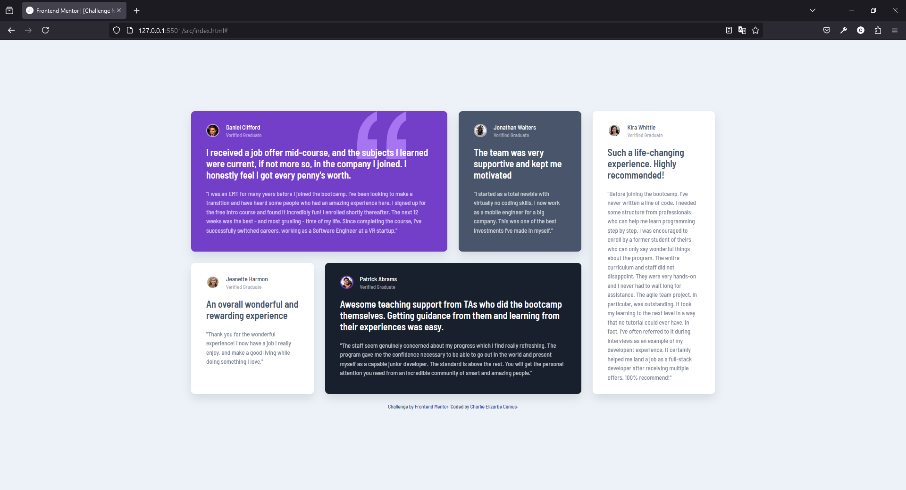
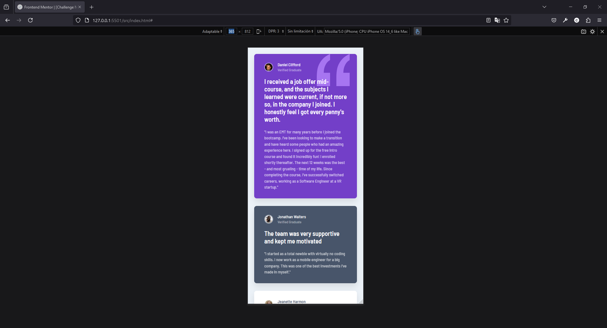

# Frontend Mentor - Solución para la sección de cuadrícula de testimonios

Esta es una solución para el [desafío de la sección de cuadrícula de testimonios en Frontend Mentor](https://www.frontendmentor.io/challenges/testimonials-grid-section-Nnw6J7Un7). Los desafíos de Frontend Mentor te ayudan a mejorar tus habilidades de codificación mediante la construcción de proyectos realistas.

## Tabla de contenidos

- [Frontend Mentor - Solución para la sección de cuadrícula de testimonios](#frontend-mentor---solución-para-la-sección-de-cuadrícula-de-testimonios)
  - [Tabla de contenidos](#tabla-de-contenidos)
  - [Resumen](#resumen)
    - [El desafío](#el-desafío)
    - [Captura de pantalla](#captura-de-pantalla)
    - [Enlaces](#enlaces)
  - [Mi proceso](#mi-proceso)
    - [Construido con](#construido-con)
    - [Lo que aprendí](#lo-que-aprendí)
    - [Desarrollo continuo](#desarrollo-continuo)
    - [Recursos útiles](#recursos-útiles)
  - [Autor](#autor)
  - [Agradecimientos](#agradecimientos)

## Resumen

### El desafío

Los usuarios deben poder:

- Ver el diseño óptimo del sitio según el tamaño de la pantalla de su dispositivo

### Captura de pantalla

### Enlaces

- URL de la solución: [Vercel](https://frontend-mentor-testimonials-grid-section-deploy.vercel.app/)

## Mi proceso

### Construido con

- HTML5
- CSS3
- Sass
- Flexbox
- CSS Grid

### Lo que aprendí

Durante este proyecto, aprendí a utilizar CSS Grid para crear diseños de cuadrícula responsivos y a mejorar mis habilidades en el uso de Flexbox para alinear elementos.

### Desarrollo continuo

Me gustaría seguir mejorando mis habilidades en CSS Grid y explorar más sobre animaciones CSS para hacer que mis proyectos sean más interactivos.

### Recursos útiles

- [MDN Web Docs - CSS Grid](https://developer.mozilla.org/en-US/docs/Web/CSS/CSS_Grid_Layout)
- [CSS Tricks - A Complete Guide to Flexbox](https://css-tricks.com/snippets/css/a-guide-to-flexbox/)
- [MyFonts - What the font](https://www.myfonts.com/es/pages/whatthefont)

## Autor

- Frontend Mentor - [@CharlieFISI](https://www.frontendmentor.io/profile/CharlieFISI)
- Github - [@CharlieFISI](https://github.com/CharlieFISI)

## Agradecimientos

Agradezco a Frontend Mentor por el reto proporcionado.
